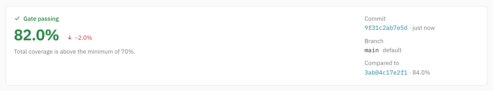

# Coverage gate

A gate is three rules, each optional — leave one off to disable it: a minimum total percentage, a minimum diff
coverage for the changed lines of PR uploads, and a max total-coverage drop.

Every repository has its own gate, set under **Coverage gates** on its repository settings page. The same card on a
workspace's settings page sets the gate repositories registered in that workspace *from then on* start with: it is
copied into a repository once, when its first upload registers it, and never read again — so changing it leaves
existing repositories exactly as they are, and those are changed one at a time in their own settings.

- **Minimum total coverage** — the minimum total percentage.
- **Minimum diff coverage** — applies to the changed lines of PR uploads (skipped when no diff coverage is available).
- **Maximum coverage drop** — bounds how far total coverage may fall below the latest gate-passing upload on the
  default branch; `0` forbids any drop.

Gate-failing uploads are recorded but never serve as a baseline, so re-running CI cannot launder a failure and a PR
cannot ratchet coverage down push by push. Violations mark the pushed build status FAILED and are reported in the PR
comment and the upload response (`gate` field).

Every upload keeps the gate it was judged against. Changing or removing a repository's gate applies to uploads from
then on; earlier verdicts, their explanations, the upload history and the dashboard keep describing the rules they were
held to, and an upload made while no gate was set reads "No gate" rather than "Passed".

## Making the gate block merges

- **Bitbucket** — require the `gocov` build in the repo's merge checks; a FAILED status then blocks the PR.
- **GitHub** — add a branch protection rule under **Settings → Branches → Require status checks to pass** and pick
  `gocov` (the commit status) or `gocov coverage` (the check run).
- **GitLab** — use **Settings → Merge requests → Status checks**
  policies that reference the `gocov` commit status.

All three require the workspace to be [connected to its forge](connecting.md). Even without one, the uploader CLI can
turn a failed gate into a failed pipeline step with [`-fail-on-gate`](cli.md).

Note that when a commit's coverage arrives in several
[parts](parts.md), the gate is evaluated against the merged report as parts arrive, so it can fail transiently until the
last part lands — sequence the gate check after all coverage jobs.

Which baseline each rule compares against, and why a delta can move on its own, is in
[Why coverage changed](coverage-changed.md).
