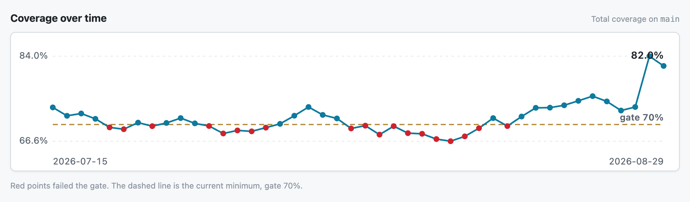

# Features

Self-hostable coverage tracking — an open-source Coveralls/Codecov alternative. Single binary + Postgres. Supported
forges: Bitbucket Cloud, GitHub and GitLab. Supported formats: Go cover profiles, LCOV tracefiles
(JavaScript/TypeScript — Jest, Vitest, nyc, c8), JaCoCo XML (Java/Kotlin — Maven, Gradle, Android), Cobertura XML
(Python — coverage.py/pytest-cov; also coverlet, gcovr), Clover XML (PHPUnit, Istanbul) and SimpleCov resultsets (Ruby);
the format is detected from the uploaded content.

- Parses Go cover profiles (`go test -coverprofile`), LCOV tracefiles (Jest/Vitest/nyc `lcov.info`), JaCoCo XML
  (`jacoco.xml`), Cobertura XML (`coverage.xml`), Clover XML (PHPUnit `clover.xml`) and SimpleCov resultsets
  (`.resultset.json`) into total and per-file coverage
- `POST /api/v1/upload` API with per-repo Bearer tokens — see
  [API & badge](api.md)
- SVG coverage badge per repo (`/badge/{workspace}/{repo}.svg`)
- Web UI: repo list → upload list → per-file coverage table
- Uploader CLI that auto-detects Bitbucket Pipelines, GitHub Actions and GitLab CI environment variables and falls back
  to git — see
  [Uploading coverage](ci-upload.md)
- Pushes a `coverage: X% (±Y%)` build status to Bitbucket commits (or a commit status to GitHub/GitLab) when the repo's
  workspace is connected to its forge
- Coverage gate: per-repo minimums for total and diff coverage plus a drop tolerance; violations push a FAILED build
  status, so a Bitbucket merge check can block the PR — see [Coverage gate](coverage-gate.md)
- Source view: any file in an upload renders line by line with coverage overlay and hit counts, fetched from the forge
  at the exact commit and cached immutably (misses are cached too); without a forge connection the page falls back to an
  uncovered-line summary. When an upload has no `path_prefix`, recorded paths that carry an unmapped leading prefix (a
  Go module path, a CI checkout directory) are resolved by probing trimmed variants against the forge

  
- Web UI sign-in with Bitbucket, GitHub and/or GitLab: configure an OAuth consumer/app and every page requires login,
  allowed only for members of the workspaces and orgs the instance tracks (see
  [Sign-in](sign-in.md)). Uploads, badges and health checks are unaffected; no passwords are ever stored
- Diff coverage for pull requests: fetches the PR diff from the forge, intersects changed lines with coverage blocks,
  and posts a PR comment listing uncovered changed lines — repeated uploads update the same comment instead of stacking
  new ones. Works on Bitbucket, GitHub and GitLab alike (on GitLab as a merge request note; GitLab has no
  check-run/Code-Insights equivalent, so the note's diff coverage table is the in-MR surface)
- Coverage inside the PR, via Bitbucket Code Insights: every upload attaches a report card to its commit (total
  coverage, delta, diff coverage, gate verdict) that Bitbucket shows in the pull request's Reports panel, and PR uploads
  annotate uncovered changed lines right in the diff view — reviewers see untested code exactly where they are reviewing
  it, with no plugin on the Bitbucket side. Changed files with no coverage data at all get a file-level marker, and the
  report card lists the worst-covered changed files while the field budget allows. Re-uploads replace the report and
  annotations in place; no coverage product on Bitbucket Cloud ships this today

  _[screenshot: coverage report card and inline annotations in a Bitbucket PR]_

- On GitHub the same surface ships as a **check run** named `gocov
  coverage`: a summary card with the identical data, a conclusion that mirrors the coverage gate (success/failure,
  neutral without a gate) so branch protection can require it, and inline annotations on uncovered changed lines in the
  Files changed view. Re-uploads replace the run in place. Writing check runs needs the GitHub App connection (see
  [Forge connections](forge-connections.md)); with other tokens the check run is skipped while status, comment and gate
  keep working

- Coverage trend chart: the repo page graphs total coverage over the branch's recent uploads (gate failures marked in
  red, every point links to its upload) — rendered as inline SVG on the server, no JavaScript chart library

  

## Architecture

The architecture is deliberately extensible: coverage formats sit behind
`profile.Parser`, forges behind `forge.Forge`, raw profile storage behind
`blobstore.Store`, and the database schema stores a format-agnostic normalized model — GitHub and GitLab were each added
this way, and new formats or S3 storage slot in without rewrites.
