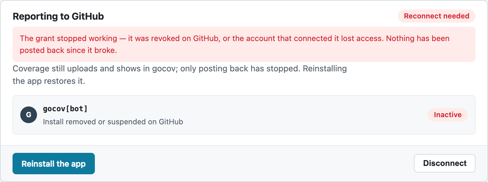

# Forge connections

Forge access is per repo, through its workspace's one-click connection:
a GitHub App installation, or a Bitbucket/GitLab grant. A repo whose workspace has no connection has no forge access —
build statuses, PR comments, diff coverage and default-branch detection are skipped for it, while coverage is still
stored and reported.

Forge access is always granted through the workspace's one-click connection — there is no manual bot token to provision.
The OAuth consumer/app used for web UI sign-in is separate from the connection grant and only needs the account/email
read permissions described in
[Sign-in](sign-in.md).

## GitHub App (one-click connect)

Instead of manufacturing a token, GitHub workspaces can install a GitHub App: one click on GitHub and statuses, PR
comments and check runs work with zero credential entry, authored by the app's bot identity (e.g. `gocov[bot]`). The App
is also the first-class Checks API citizen, so check runs stop being permission-fragile.

To run one on your own deployment:

1. Register a GitHub App (**Settings → Developer settings → GitHub Apps → New GitHub App**) with
    - **Setup URL**: `https://your-gocov-host/github/setup`, with *Redirect on update* enabled
    - **Webhook**: optional. gocov's model is upload-driven, so a self-hosted app can leave it disabled — installs are
      linked through the setup redirect and uninstalls are detected lazily. A **Marketplace listing requires it**: set
      the webhook URL to
      `https://your-gocov-host/github/webhook`, a webhook secret, and
      `GOCOV_GITHUB_WEBHOOK_SECRET` to the same value on the server. The endpoint verifies each delivery's signature; it
      logs
      `marketplace_purchase` events and flips a workspace's app-broken flag on `installation` deleted/suspend/unsuspend
    - **Repository permissions**: *Checks: Read & write*, *Commit statuses: Read & write*, *Pull requests: Read &
      write*, *Contents: Read-only*, *Metadata: Read-only*
    - **Organization permissions**: *Members: Read-only* (org membership for sign-in sync)
2. Generate a private key on the app page and set both variables on the server:

```sh
GOCOV_GITHUB_APP_ID=...
GOCOV_GITHUB_APP_PRIVATE_KEY=/path/to/gocov.private-key.pem  # or the PEM content itself
```

Members then connect from the workspace settings or setup page ("Install the gocov app"); after GitHub's install screen
they land back on gocov with the workspace connected. In hosted mode the install can even come first — an install on an
account with no workspace yet registers it on the spot (same claim rules as **/register**, see
[Getting started](getting-started.md)).

A connected installation is what gives the workspace's repos forge access. Uninstalling the app on GitHub is detected on
the next upload — the affected surfaces degrade to `skipped`, never to a failed upload — and the settings page offers a
reconnect.



The GitHub App covers every surface, check runs included — nothing to provision per repo beyond installing the app on
the org or account. gocov recognizes its own PR comment by its `**gocov**` marker and updates it in place.

To make the coverage gate blocking on GitHub, add a branch protection rule under **Settings → Branches → Require status
checks to pass** and pick `gocov` (the commit status) or `gocov coverage` (the check run). A failed gate then blocks the
merge.

## Bitbucket workspace connect (one-click)

Bitbucket workspaces get the same effortless path: a member clicks **Connect workspace** on the settings (or setup)
page, consents once on Bitbucket, and statuses, PR comments, reports, diffs and source fetch work from then on. To
enable it, the deployment needs the sign-in OAuth consumer plus an encryption key:

```sh
GOCOV_SECRET_KEY=...   # 64 hex characters (`openssl rand -hex 32`); encrypts the stored grant at rest
```

The value is hex-decoded straight into the AES key, so it must itself carry the full 256 bits of entropy: there is no
key-stretching step behind it. The server requires exactly 64 hex characters and refuses to boot on anything else —
generate it with `openssl rand -hex 32` rather than inventing a passphrase.

The consumer's permissions must also be extended beyond sign-in:
**Account: Read**, **Email**, **Repositories: Write**, **Pull requests: Write**. (Bitbucket scopes live on the consumer,
not the consent request, so the sign-in consent lists them too — sign-in itself still stores no forge tokens.)

Honest caveat, stated in the UI at connect time: Bitbucket has no app identity, so posts appear as the account that
clicked Connect. Teams with a bot account should sign the bot in and connect with it.

The grant's refresh token is stored on the workspace, AES-GCM-encrypted under `GOCOV_SECRET_KEY`; access tokens live
only in memory. Bitbucket rotates refresh tokens on every use — gocov persists each rotation atomically. If the grant
dies (the connecting account leaves the workspace, the consent is revoked under *Personal settings → Authorized
applications*, or the token ages out after three unused months), the next upload degrades to `skipped`, never to a
failure, and the settings page offers a reconnect.

The Bitbucket connect grant covers every surface: build status, Code Insights report and annotations, PR diff coverage,
PR comments, source view and default branch. Because the grant carries the connecting account's identity, gocov
recognizes its own earlier PR comment and updates it in place rather than stacking new ones.

## GitLab connection (one-click)

GitLab workspaces are connected with one OAuth consent: on the workspace settings (or setup) page, **Connect workspace**
sends a member through GitLab's consent screen with the `api` scope, and from then on statuses, MR comments, diffs and
source fetch act through that grant. Posts visibly appear as the account that clicked Connect, so teams with a bot
account should connect with it. The grant's refresh token is stored encrypted (`GOCOV_SECRET_KEY`) and rotates on every
use; revoking the application on GitLab (or the member leaving) skips the forge surfaces and surfaces a "reconnect"
prompt.

Requirements on top of GitLab sign-in: `GOCOV_SECRET_KEY` must be set, and the GitLab OAuth application must carry the
**`api` scope in addition to** `read_user` and `read_api` — sign-in keeps requesting only the read scopes; the bigger
consent happens solely on Connect.

gocov recognizes its own MR note by its `**gocov**` marker and updates it in place. To make the coverage gate blocking
on GitLab, use **Settings → Merge requests → Status checks** policies that reference the `gocov` commit status; a failed
gate then blocks the merge. GitLab has no check-run equivalent — the MR note's diff coverage table is the in-MR surface,
and uploads report `code_insights: skipped` by design.
