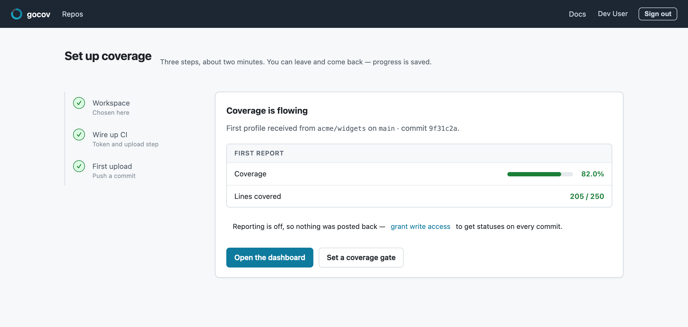
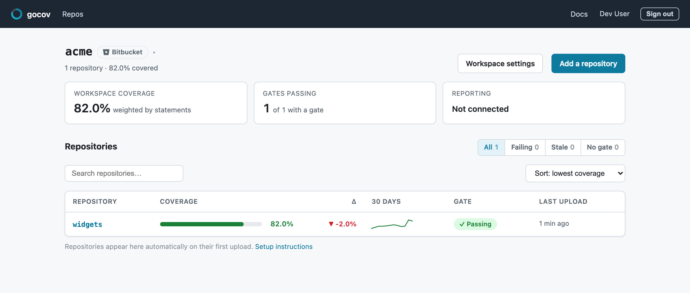

# Getting started

By the end of this page a push carries its own coverage: a percentage and a delta on the commit, a comment and a build
status on the pull request, a gate that can hold a merge, and a badge for the README. Three things get you there — a
token, an upload step in CI, and a forge connection.

## 1. Get a workspace and its upload token

A *workspace* is the namespace gocov tracks: a GitHub org or user, a GitLab group or subgroup, a Bitbucket workspace.
Repos under it register themselves on their first upload, so this is the only thing you create by hand.

**On the hosted service**, sign in at [app.gocov.dev](https://app.gocov.dev/?ref=docs) with your forge account. If you
belong to no workspace gocov already tracks you land on **/register**, which lists the workspaces your forge account is
a member of. Claiming one creates it, makes you a member, and shows its **upload token — once**. Only workspaces the
forge itself reports for your account can be claimed, so there is nothing to dispute: if a colleague registered yours
first, signing in simply makes you a member.

**On your own instance**, start one with `docker compose up` — Postgres and the server come up on
http://localhost:8080 and migrations apply themselves. Onboarding derives the workspaces you may register from your
signed-in forge identity, so a fresh instance needs [sign-in enabled](sign-in.md) before there is an identity to
register from; after that the wizard is the same as above. That compose file is for evaluating gocov rather than
running it — when the instance becomes one other people upload to, read [Self-hosting](self-hosting.md).

Either way you end up on an onboarding page with the CI snippet for your forge already filled in, and a live "waiting
for your first upload" state that turns into the repo link once coverage arrives.

## 2. Add the upload step to CI

Set the token as a *workspace variable* (`GOCOV_TOKEN`, secured) so every repo under the workspace inherits it. On a
self-hosted instance set `GOCOV_SERVER` beside it; on the hosted service the server is implicit and the token is all
you need.

Then add one upload step to the pipeline — the recipes for Bitbucket Pipelines, GitHub Actions and GitLab CI, and for
each coverage format, are in [Uploading coverage](ci-upload.md). The first upload registers the repo.

## 3. Connect the workspace to its forge

One click, from the workspace's settings page: a GitHub App installation, or a Bitbucket/GitLab grant. See
[Forge connections](forge-connections.md).

This step is easy to skip and it is where most of the product lives. Without it gocov still accepts uploads, stores
history, evaluates the gate and serves the badge — but everything that reaches your team where they work is off, since
all of it goes through the forge's API:

| with a connection | without one |
|---|---|
| build status on the commit | — |
| coverage comment on the pull request | — |
| check run with per-file annotations | — |
| diff coverage (needs the PR's diff) | total coverage only |
| default branch detected from the forge | falls back to the workspace default |

## What you have now

The dashboard lists every repo that has uploaded, with its coverage, its trend and whether its gate is passing. Each
workspace links to a **settings** page: rotate the upload token (the old one dies immediately, the new one is shown
once and never rendered back), set the default branch and the gate defaults new repos inherit, and connect or
disconnect the forge.

Who sees what follows your forge: members of the workspace see its repos and nobody else does, with no invite step to
manage — [Sign-in](sign-in.md) has the details.

## Next steps

- [Uploading coverage](ci-upload.md) — wire your pipelines up
- [Coverage gate](coverage-gate.md) — set minimums and make them block merges
- [Configuration](configuration.md) — the full environment variable reference
