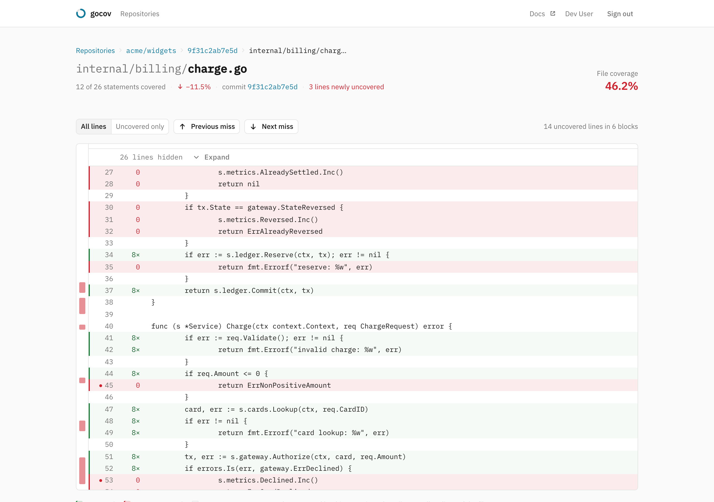

# Coverage in pull requests

Once a workspace is [connected to its forge](connecting.md), every upload that belongs to a pull request reports back
where the review happens. All of it updates in place on re-upload — nothing stacks.

## Diff coverage

gocov fetches the PR's diff from the forge, intersects the changed lines with the coverage report, and answers the
question a reviewer actually has: *of the lines this PR touches, how many are tested?* Diff coverage feeds every
surface below and can carry its own [gate rule](coverage-gate.md).

If diff coverage comes out empty while total coverage looks fine, the profile's paths are not matching the repo's —
see [Why coverage changed](coverage-changed.md).

## The PR comment

A comment on the pull request with total coverage, the delta, diff coverage and the uncovered changed lines. Repeated
uploads update the same comment instead of stacking new ones. On GitLab it is posted as a merge request note. The
*Full report* link opens without sign-in when the repo is public — see [public reports](public-reports.md). On the
hosted service the comment ends with a small one-line gocov signature; self-hosted instances never add one.

## The build status

Every upload pushes a `coverage: X% (±Y%)` status to the commit — FAILED when the gate fails, which is what lets a
branch protection rule or merge check [block the merge](coverage-gate.md#making-the-gate-block-merges).

## Inline annotations

- **GitHub** — a check run named `gocov coverage`: a summary card (total, delta, diff coverage, gate verdict), a
  conclusion that mirrors the gate so branch protection can require it, and inline annotations on uncovered changed
  lines in the Files changed view.
- **Bitbucket** — a Code Insights report card on the commit, shown in the PR's Reports panel, with inline annotations
  on uncovered changed lines right in the diff view. Changed files with no coverage data at all get a file-level
  marker. No other coverage product on Bitbucket Cloud ships this today.
- **GitLab** — GitLab has no check-run equivalent, so the MR note's diff coverage table is the in-MR surface.

## Fork PRs without a token

On GitHub, a workflow run for a PR opened from a fork cannot read repository secrets — there is no token to upload
with. When the repo is **public** and its workspace is [connected through the gocov GitHub App](connecting.md), the
uploader falls back to tokenless mode: instead of a token it names the workflow run it is, and the server verifies
with GitHub — through the App installation, so there is no anonymous rate limit to drown in — that the run is real,
still in progress, a `pull_request` build of that repo at that head commit, and that the PR is open. Contributors get
the comment, check run and status above with zero setup on their side.

A verified tokenless upload is still not the same as a token: it appears with an **unverified contributor upload**
badge in the UI, never feeds the default-branch trend, badge or comparison baseline, and each workflow run attempt is
accepted once per part. Private repos always require a token. If verification fails, the upload is refused with the
reason in the CI log — and the build stays green.

## The source view

Any file in an upload renders line by line with a coverage overlay and hit counts, fetched from the forge at the exact
commit. The rail maps every miss in the file, and the lines the commit newly uncovered are called out.

## Without a connection

A repo whose workspace has no forge connection still stores coverage, evaluates the gate and serves the badge — but
all of the surfaces above go through the forge's API, so they are skipped (reported as `skipped` in the upload
response, never as a failure). [Connect your forge](connecting.md) is one click.
