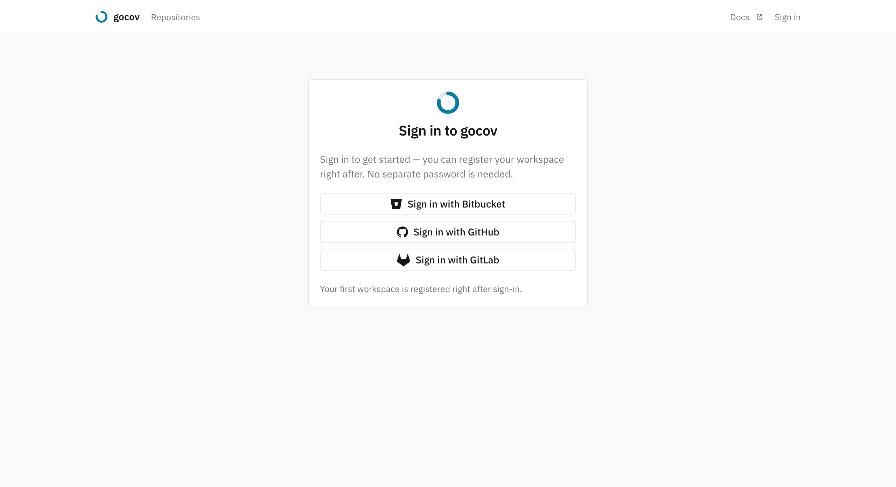

# Enable sign-in (Bitbucket, GitHub and/or GitLab)

Out of the box the web UI is open and shows a banner saying so — nothing changes on upgrade until you opt in. Configure
one or more providers; each renders as its own button on the login page.



## Bitbucket

1. Create an OAuth consumer under **Workspace settings → OAuth consumers → Add consumer** with
    - **Callback URL**: `https://your-gocov-host/oauth/bitbucket/callback`
      (must be exactly `GOCOV_BASE_URL` + `/oauth/bitbucket/callback`)
    - **Permissions**: *Account: Read* and *Email* only — nothing broader is needed
2. Set the consumer's key and secret on the server:

```sh
GOCOV_OAUTH_BITBUCKET_KEY=...
GOCOV_OAUTH_BITBUCKET_SECRET=...
```

## GitHub

1. Create an OAuth app under **Settings → Developer settings → OAuth Apps → New OAuth App** (on your account or org)
   with
    - **Authorization callback URL**:
      `https://your-gocov-host/oauth/github/callback`
2. Set the app's client id and secret on the server:

```sh
GOCOV_OAUTH_GITHUB_KEY=...
GOCOV_OAUTH_GITHUB_SECRET=...
```

gocov requests the read-only `read:org` and `user:email` scopes at login. Note that org members may need to
grant/request the app's access to the org once (GitHub's third-party application policy) for the org to appear in their
membership.

## GitLab

1. Create an OAuth application under **Preferences → Applications** (or on a group/instance) with
    - **Redirect URI**: `https://your-gocov-host/oauth/gitlab/callback`
    - **Scopes**: `read_user` and `read_api` only — nothing broader is needed
2. Set the application's id and secret on the server:

```sh
GOCOV_OAUTH_GITLAB_KEY=...
GOCOV_OAUTH_GITLAB_SECRET=...
```

Membership is derived from the account's groups — subgroups included, each by its full path (`group/subgroup`) — plus
the username itself, so user-namespace projects admit their owner.

## The access model

From then on every UI page requires signing in. Access is decided at login time by membership: by default, members of
any workspace/org the instance tracks (registered workspaces and the workspace part of registered repo slugs) may sign
in, and everyone else gets a clear denial page; on GitHub the account's own username also counts, so user-namespace
repos admit their owner. Set `GOCOV_ALLOWED_WORKSPACES`
(comma-separated workspace/org slugs) to replace the derived set with an explicit list. Accounts are provisioned on
first successful sign-in — there is no user bookkeeping, and gocov never sees or stores passwords (the forge tokens are
discarded right after login).

What a signed-in account then sees mirrors that membership: the repo list is filtered to the workspaces the forge
says it belongs to, and a direct link to another workspace's repo, upload or source page returns 404. Membership is
re-derived at each login rather than per request, so removing someone on the forge removes their access at their next
login; sessions last 30 days. There is no separate invite or member-management step — add someone to the workspace on
the forge and they see its coverage when they next sign in. A single-team instance where everyone belongs to the same
workspace is unaffected, as is one with sign-in left open.

## Hosted mode (self-service signup)

`GOCOV_MODE=hosted` turns the instance into a self-service one: any forge account may sign in, and a user who belongs to
no tracked workspace lands on **/register**, which lists the workspaces their forge account is a member of (captured at
sign-in). Claiming one creates the workspace, makes the user a member and shows the upload token — once; afterwards it
can only be rotated. Only workspaces the forge itself reports for the account can be registered, so there is nothing to
dispute: if a colleague registered your workspace first, signing in simply makes you a member.

Registration lands on an onboarding page: the forge-appropriate CI snippet with the server URL and token pre-filled, and
a live "waiting for your first upload" state that flips to the repo link once coverage arrives.

The default (`GOCOV_MODE=private`) keeps exactly the behavior described above — self-hosted deployments upgrade
with zero change. Hosted mode requires at least one sign-in provider.

## Bootstrapping a fresh private instance

A brand-new instance tracks no workspaces yet, so the derived allow-set is empty and no one could sign in. Set
`GOCOV_ALLOWED_WORKSPACES` to the workspace/org you want to track (e.g. `GOCOV_ALLOWED_WORKSPACES=myorg`)
so its members can sign in; the first member to sign in lands on the onboarding wizard and registers the workspace,
which mints its upload token. With an explicit `GOCOV_ALLOWED_WORKSPACES`, sign-in stays pinned to that list no matter
what gets registered later; leave it unset and the allow-set grows to include every workspace registered from the UI.
Signed-in members can register any workspace their forge account vouches for.

CI is unaffected either way: the upload API keeps its Bearer tokens, badges stay embeddable, `/healthz` stays open.

## Public report pages

Repos the forge reports as public additionally get anonymous read-only
[report pages](public-reports.md) — members can turn them off per repo in repo settings, and
`GOCOV_PUBLIC_REPORTS=off` turns the whole feature off for the instance, keeping every page behind the login wall.
An instance running inside a private network typically wants exactly that one switch.
